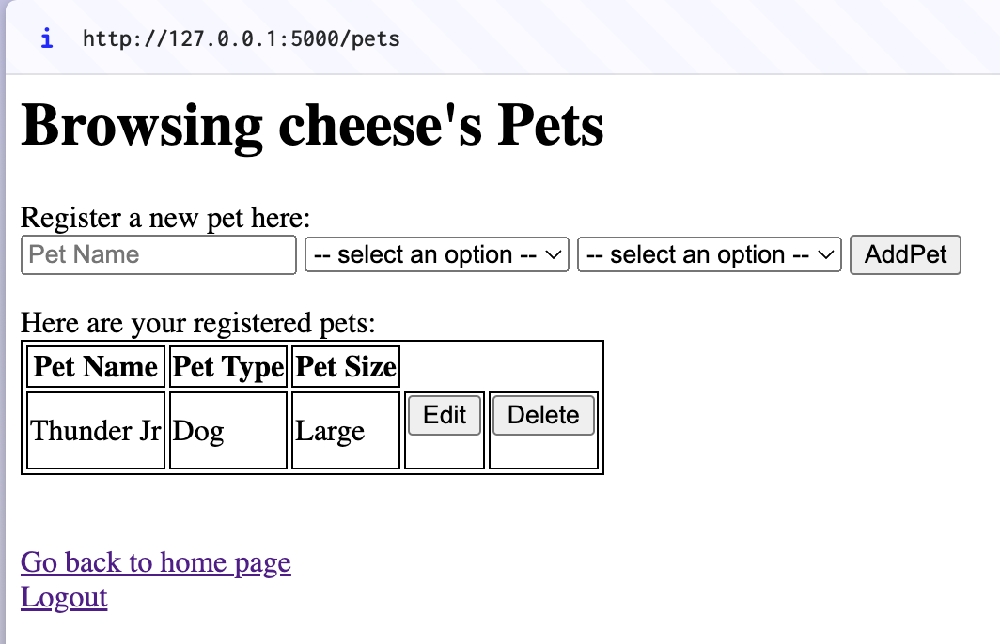
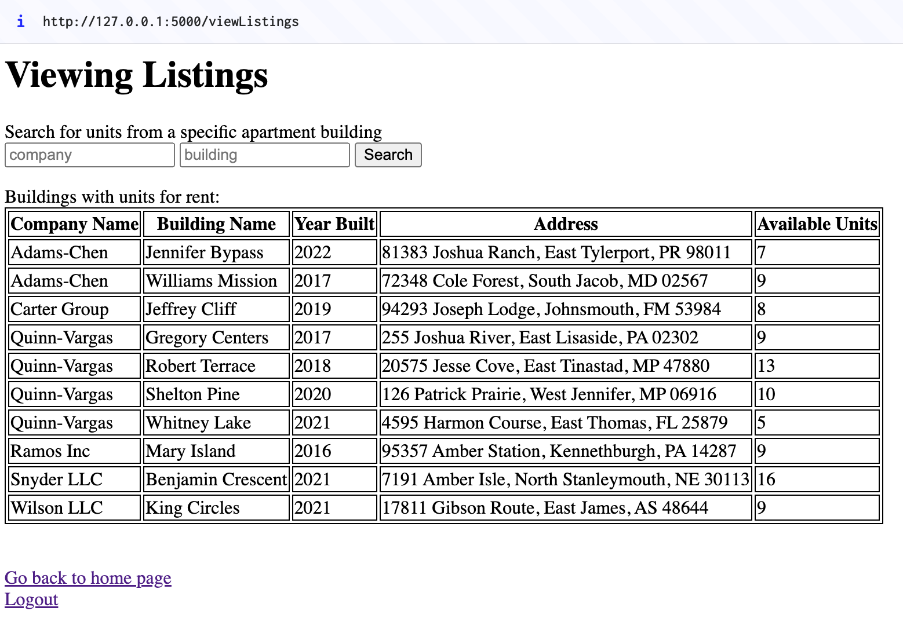
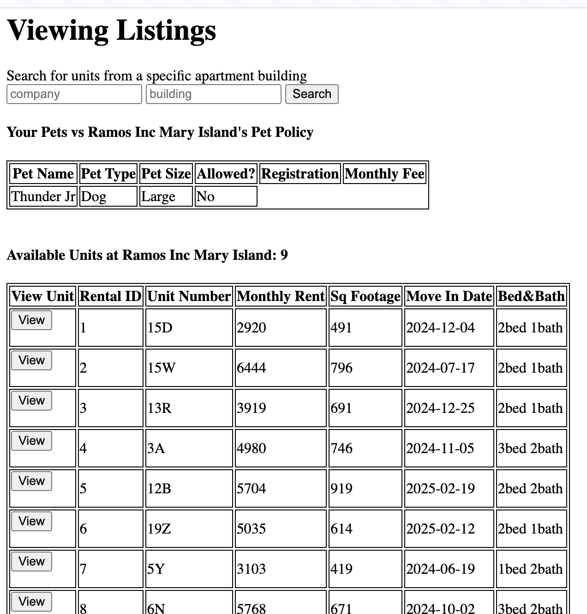
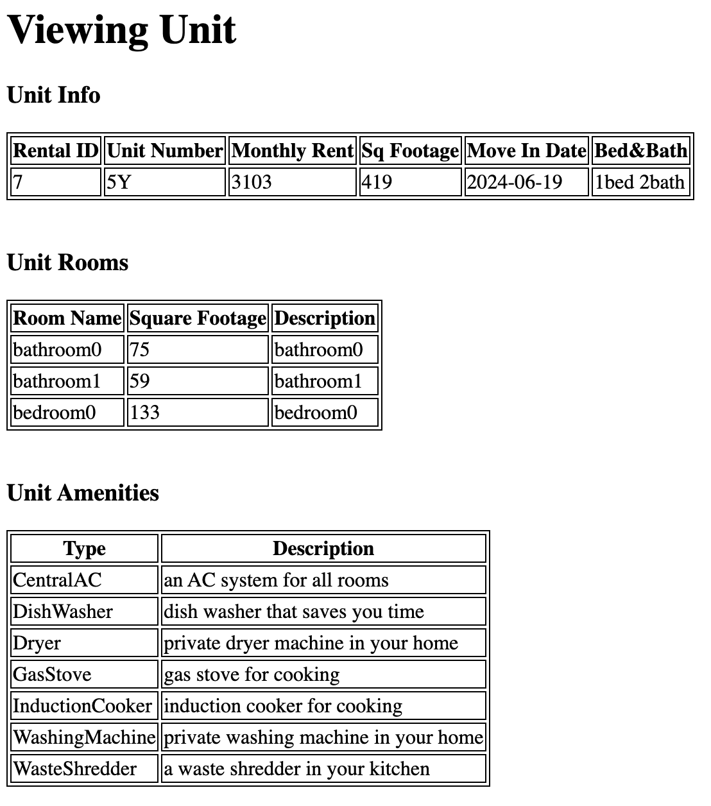
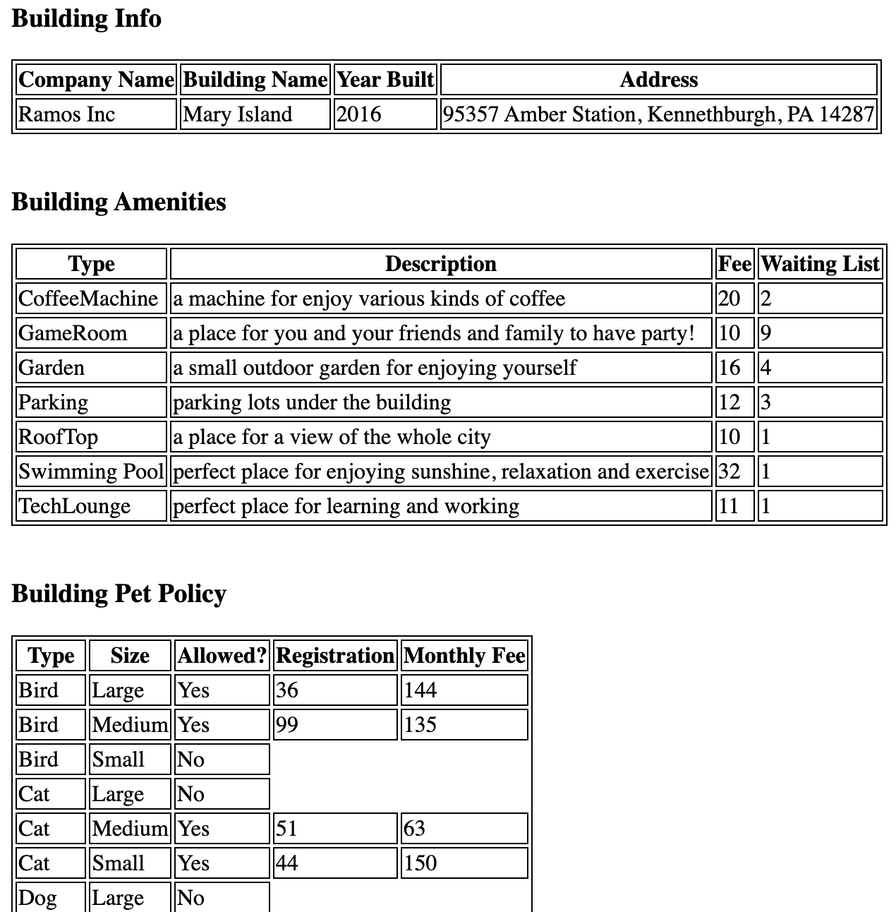
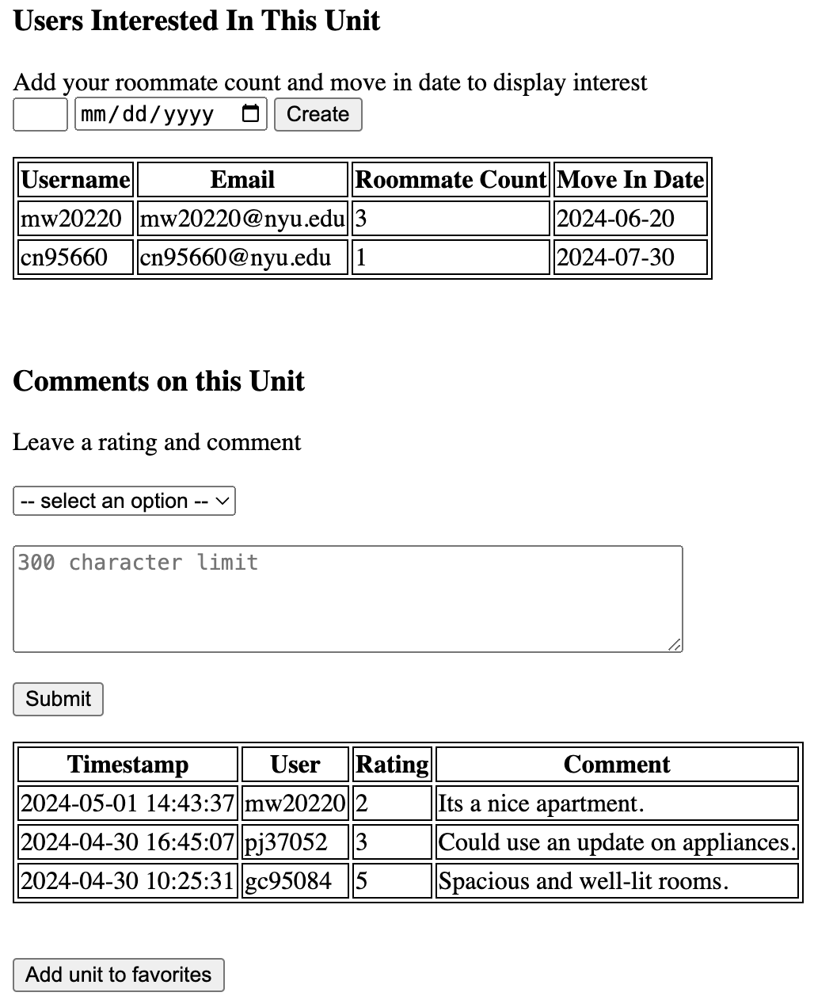

# RoomioApplication

Description:

A web program that simulates an apartment rental service. Utlizes Python, Flask, MySQL, HTML, MAMP

Designed as a project for CS-GY 6083
Developer: Omer Basar

Feature List locations in init1.py:
- Login: 
  - loginAuth() at line 40 to 60
- Registration: 
  - registerAuth() at line 64 to 92

- Search 2a: 
  - viewListings() at line 110 to 121
  - searchListings() at line 125 to 157
- Search 2b: at line 148

- Register pet:
  - addPet() at line 369 to 392
  - deletePet() at line 472 to 485
  - editPet() at line 396 to 419
  - changePet() at line 423 to 468

- Post/view Interest: 
  - makeInterest() at line 230 to 254
  - deleteInterest() at line 257 to 269

- Display unit/building info:
  - viewUnit() at line 161 to 228

- Favorite system:
  - addFavorite() at line 310 to 322
  - deleteFavorite at line 326 to 337

- Comment system:
  - makeComment() at line 273 to 290
  - deleteComment() at line 294 to 306

# Screenshots

# Progress As Of April 30
- Implemented Comments and Favorite features

# Progress As Of April 27
- Implemented Search and Display units feature
- Reorganized, cleaned, and commented code

# Progress As Of April 26
- Implemented Interests feature
- Partial implementation of unit/building views

# Progress As Of April 25
- Implemented basic view sample listings with some information
- Fixed various bugs such as pet edit feature edge cases

# Progress As Of April 23
- Implemented pet management system with ability to add, edit, and delete
- Added character limit for text boxes to prevent overflow

# Progress As Of April 7
- Implemented Login/Registration system with hashing/salting
- Inserted sample data into every table
